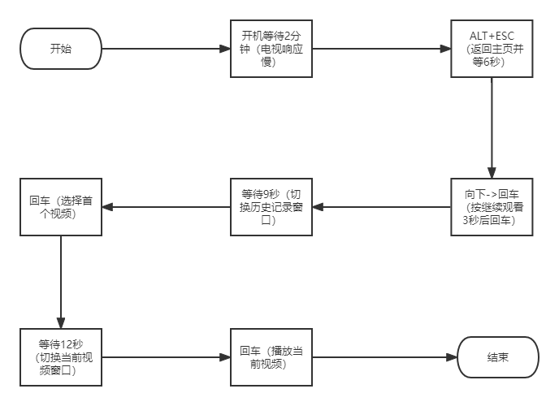

# xiaomi_tv_auto_player

# 需求描述：实现小米电视开机自动播放《萌鸡小队》

# 环境说明：

电视: Redmi A32 L32R6-A (Android 5.1.1, MiTV OS 2.0.8)

开发板:

Digispark Attiny85

Leonardo usb ATMEGA32U4

软件:

Arduino-1.8.13

Digistump Drivers

Windows 10 x64

# 流程图

# 要求：

确保《萌鸡小队》在最近播放列表（上一次播放的视频）

# 开发板分析：

Leonardo 开发环境，官方原生支持。

Digispark Attiny85 需另外配置开发环境，keyboard库也不完善。主要优势在于价格。
